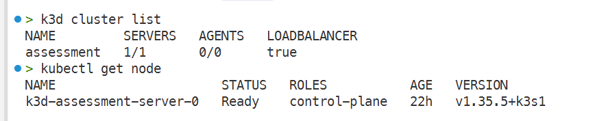
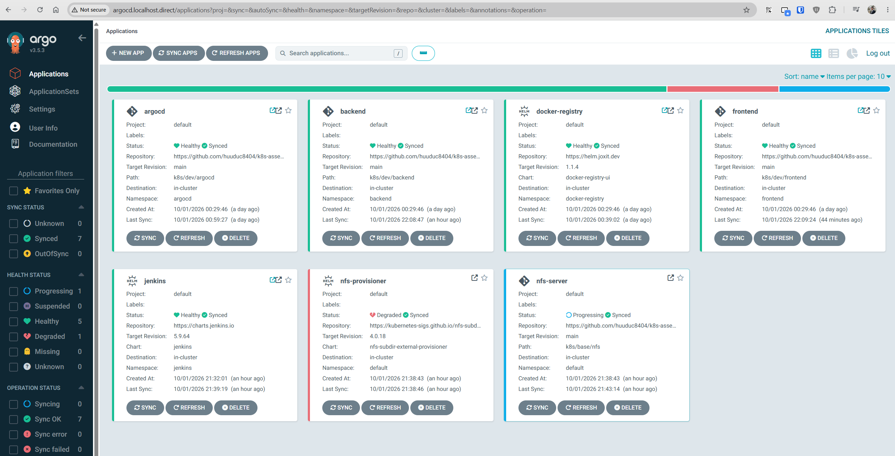
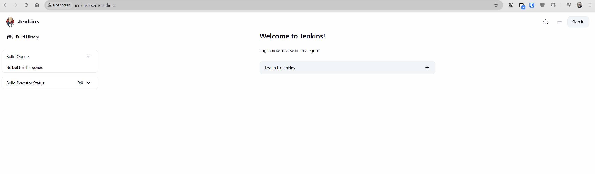
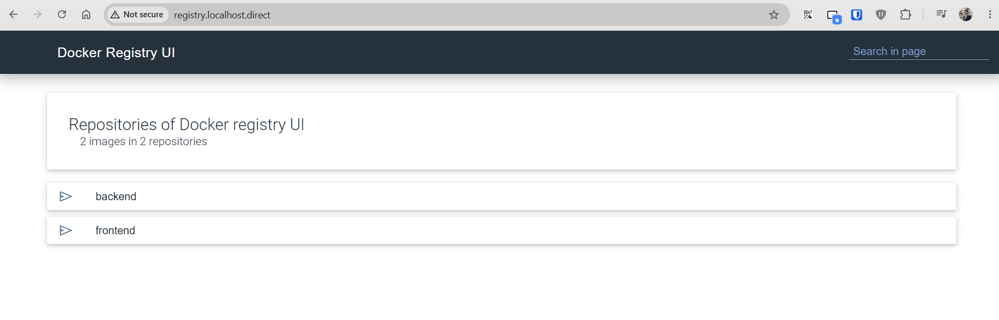
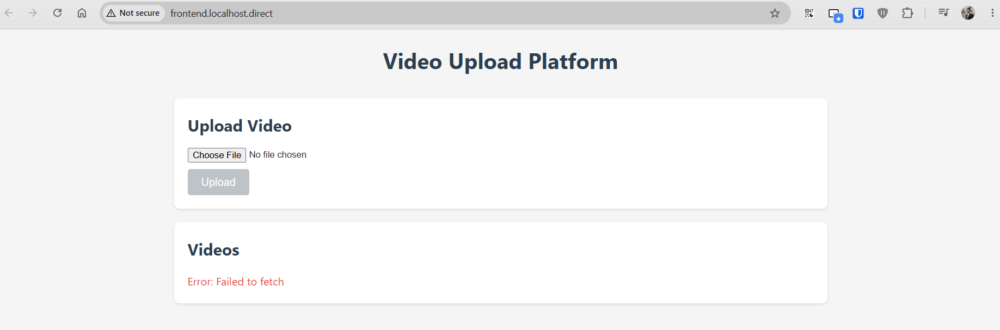

# k8s Assessment Monorepo — Reviewer Setup

Reproduces the assessment cluster from scratch: k3d + Traefik, Argo CD (GitOps), in-cluster Docker Registry,
NFS storage, Jenkins CI, and frontend/backend workloads.

## Implementation status

Legend: ✅ done · 🔶 partial · ❌ not implemented / broken

### Requirements coverage

| Assessment requirement                                                  | Status | Evidence                                                                                                                                                                   |
| ----------------------------------------------------------------------- | ------ | -------------------------------------------------------------------------------------------------------------------------------------------------------------------------- |
| §2 Architecture: Traefik → frontend → backend → NFS → processing        | 🔶      | Ingress + both Services exist, but nothing is mounted on NFS and no processing component exists                                                                            |
| §3.1 Frontend: pick MP4, upload, show result, list, thumbnail, versions | 🔶      | AI-generated code that has not been reviewed or tested.                                                                                                                    |
| §3.2 Backend: upload / list / status / versions / health GraphQL API    | 🔶      | AI-generated code that has not been reviewed or tested.                                                                                                                    |
| §3.2 `/uploads` backed by NFS                                           | ❌      | AI-generated code that has not been reviewed or tested.                                                                                                                    |
| §3.3 Real transcoding to 2K/1080p/720p/480p + thumbnail                 | ❌      | Not yet implemented.                                                                                                                                                       |
| §3.3 Processing survives component failure                              | ❌      | Not yet implemented.                                                                                                                                                       |
| §4 Deployments: frontend, backend, ingress, health, replicas            | 🔶      | frontend 2/2, backend 2/2, ingresses registered, probes defined.                                                                                                           |
| §4 Failover demonstration                                               | ❌      | `failover-test.md` describes a kind + NGINX + emptyDir environment that does not match this repo (k3d + Traefik + real NFS) and reports PASS results not reproducible here |
| §4 Cleanup command                                                      | ✅      | `k3d cluster delete assessment`                                                                                                                                            |
| §5 Shared storage across backend pods                                   | ❌      | Not yet implemented.                                                                                                                                                       |
| §6 Rollout / rollback                                                   | 🔶      | Deployment strategy exists in the manifests; not exercised against a working backend                                                                                       |
| §7 `ai-usage-log.md`                                                    | ✅      | Present and candid about AI authorship                                                                                                                                     |
| §8 Docs: README, architecture, failover-test, production-notes          | 🔶      | All four exist and are well written, but `architecture.md` and `failover-test.md` describe a video processor, ffmpeg, and NGINX ingress that are not in the tree           |
| §11 End-to-end works                                                    | ❌      | See blockers below                                                                                                                                                         |

### Screenshots






### Cluster component status

| Component                                    | Status | Evidence                                                                                                      |
| -------------------------------------------- | ------ | ------------------------------------------------------------------------------------------------------------- |
| k3d cluster + Traefik ingress                | ✅      | 5 ingresses registered, all 5 URLs return HTTP 200                                                            |
| Argo CD bootstrap + self-heal                | ✅      | `argocd` Synced/Healthy, 7/7 components 1/1                                                                   |
| Docker Registry (`docker-registry-ui` 1.1.4) | ✅      | Synced/Healthy, `/v2/_catalog` → `backend`, `frontend`                                                        |
| Image updater (digest pinning)               | ✅      | `apps-image-updater` is ready; the frontend and backend can be deployed whenever a new image is pushed.       |
| Frontend Deployment                          | ✅      | Synced/Healthy, 2/2 replicas, serves the React build. The app itself cannot reach the backend (see blocker 3) |
| NFS server (StatefulSet)                     | 🔶      |                                                                                                               |
| Jenkins                                      | 🔶      | The Jenkins server has been initialized, but the pipeline has not yet been deployed.                          |
| NFS dynamic provisioning                     | ❌      |                                                                                                               |
| Backend app                                  | ❌      |                                                                                                               |

## Service URLs

| Service         | URL                                |
| --------------- | ---------------------------------- |
| Argo CD         | <http://argocd.localhost.direct>   |
| Jenkins         | <http://jenkins.localhost.direct>  |
| Docker Registry | <http://registry.localhost.direct> |
| Frontend        | <http://frontend.localhost.direct> |
| Backend         | <http://backend.localhost.direct>  |

No `/etc/hosts` entry needed — `*.localhost.direct` resolves to `127.0.0.1` on most resolvers and k3d
publishes port 80. If yours does not resolve it, add:

```
127.0.0.1 argocd.localhost.direct frontend.localhost.direct backend.localhost.direct jenkins.localhost.direct registry.localhost.direct
```

## Prerequisites

`docker`, `k3d`, `kubectl`, `helm`, `git`, and outbound network access (Argo CD pulls manifests from
`raw.githubusercontent.com`, Helm charts from `helm.joxit.dev` / `kubernetes-sigs.github.io`). Allow 4 GB+
free RAM for Docker.

```bash
# k3d, if not installed
wget -q -O - https://raw.githubusercontent.com/k3d-io/k3d/main/install.sh | bash
```

## 1. Create the cluster

```bash
k3d cluster create --config k8s/k3d/config.yaml
```

## 2. Bootstrap Argo CD

```bash
kubectl apply -k k8s/dev/argocd --server-side
kubectl -n argocd rollout status deploy/argocd-server --timeout=300s
```

## 3. Register the GitOps applications

```bash
kubectl apply -k k8s/dev/applications
kubectl -n argocd get applications -w
```

| Application          | Namespace         | Source                                              |
| -------------------- | ----------------- | --------------------------------------------------- |
| `argocd`             | `argocd`          | `k8s/dev/argocd` (self-management)                  |
| `backend`            | `backend`         | `k8s/dev/backend`                                   |
| `frontend`           | `frontend`        | `k8s/dev/frontend`                                  |
| `jenkins`            | `jenkins`         | `k8s/dev/jenkins`                                   |
| `docker-registry`    | `docker-registry` | Helm chart `docker-registry-ui` 1.1.4               |
| `nfs-server`         | `default`         | `k8s/base/nfs` (StatefulSet + PVC)                  |
| `nfs-provisioner`    | `default`         | Helm chart `nfs-subdir-external-provisioner` 4.0.18 |
| `apps-image-updater` | —                 | digest watch for frontend/backend                   |

All are automated with `prune: true` and `selfHeal: true`. NFS needs no manual step: `nfs-server` and
`nfs-provisioner` are applied by Argo CD, and the provisioner creates the `nfs-client` StorageClass.

**Reviewers:** the Applications point at `https://github.com/huuduc8404/k8s-assessment-monorepo.git` on branch
`main`, not your local tree. Unpushed changes are not reflected — push to `main`, or repoint `repoURL` at your
fork and force-sync.

## 4. Credentials

```bash
# Argo CD (user: admin)
kubectl -n argocd get secret argocd-initial-admin-secret -o jsonpath="{.data.password}" | base64 -d; echo

# Jenkins (user: admin) — generated by JCasC on first boot
kubectl -n jenkins get secret jenkins -o jsonpath="{.data.jenkins-admin-password}" | base64 -d; echo
```

If the Jenkins key is empty, the controller is still booting:

```bash
kubectl -n jenkins rollout status deploy/jenkins --timeout=300s
```

## 5. Build and push images

The deployments reference `localhost:31000/frontend` and `localhost:31000/backend` with tag `latest`. Nothing
deploys until those tags exist.

```bash
docker build -t registry.localhost.direct/backend:latest  backend/
docker push   registry.localhost.direct/backend:latest
docker build -t registry.localhost.direct/frontend:latest frontend/
docker push   registry.localhost.direct/frontend:latest
```

Push to `registry.localhost.direct`, **not** `localhost:31000`

## 6. Wait for the automatic deploy

You do **not** sync anything after pushing. The `apps-image-updater` `ImageUpdater` polls the registry every
**2 minutes** (`k8s/dev/argocd/argocd-image-updater-config.yaml`), writes the new digest into the live
`Application` (`spec.source.kustomize.images`, method `argocd`), and automated sync rolls the Deployment.
Nothing is committed to `main`; the Git manifests stay at `newTag: latest` and the digest is a live override.

```bash
# updater saw a new digest
kubectl -n argocd logs deploy/argocd-image-updater-controller --tail=50 | grep "Setting new image"

# deployments picked it up (expect localhost:31000/backend:latest@sha256:...)
kubectl -n backend  get deploy backend  -o jsonpath='{.spec.template.spec.containers[0].image}{"\n"}'
kubectl -n frontend get deploy frontend -o jsonpath='{.spec.template.spec.containers[0].image}{"\n"}'
```

**If the updater never updates:** `registries.conf` is read only at process start, so an edit applied after the
pod booted is ignored (symptom: `Could not get tags from registry ... connection refused`). Verify what the
process loaded, then restart:

```bash
kubectl -n argocd logs deploy/argocd-image-updater-controller | grep "Loaded .* registry"
# expected: Loaded 1 registry configurations

kubectl -n argocd rollout restart deploy/argocd-image-updater-controller
```

Restart is required after **any** edit to `k8s/dev/argocd/argocd-image-updater-config.yaml`.

## 7. Verify

```bash
kubectl -n argocd get applications           # all Synced / Healthy
kubectl get statefulset nfs-server
kubectl get pvc -n default nfs-storage       # the NFS server's own 10Gi local-path volume
kubectl get pvc -n default nfs-pvc           # provisioned from nfs-client
kubectl get storageclass nfs-client
kubectl get deploy -A                        # frontend/backend 2/2
kubectl get ingress -A
curl -s http://registry.localhost.direct/v2/ && echo OK
kubectl get pods -A -o wide
```

Target end state (see **Implementation status** for what is actually true today): all seven Applications
`Synced`/`Healthy`; `nfs-client` StorageClass present; `nfs-server`
1/1 with `nfs-storage` bound; `frontend` and `backend` 2/2 ready and pinned to an `@sha256:` digest matching the
registry's current `latest`; all five service URLs reachable.

## 8. Tear down

```bash
k3d cluster delete assessment
```

The registry, its images, and all NFS data live inside the cluster node and are removed with it.

## Troubleshooting

| Symptom                                                                  | Cause / fix                                                                                                                                            |
| ------------------------------------------------------------------------ | ------------------------------------------------------------------------------------------------------------------------------------------------------ |
| Pods `ImagePullBackOff`                                                  | No one pushed the tags — run section 5.                                                                                                                |
| App stuck `OutOfSync`                                                    | Git repo differs from local. Push to `main`, or repoint `repoURL` and force-sync.                                                                      |
| `nfs-provisioner` not synced                                             | `kubernetes-sigs.github.io/nfs-subdir-external-provisioner` unreachable, or the chart version in `k8s/dev/applications/nfs-provisioner.yaml` is wrong. |
| `nfs-server` / `nfs-pvc` stuck `Pending`                                 | Missing `local-path` class or no free disk, or the provisioner has not created the sub-directory yet. Check `kubectl get events`.                      |
| Argo CD apply errors on CRDs                                             | Use `--server-side`.                                                                                                                                   |
| Image updater logs `connection refused` on `https://localhost:31000/v2/` | Stale `registries.conf`; the pod dials its own loopback. See section 6.                                                                                |
| `argocd.localhost.direct` refuses connection                             | Port mapping or DNS. Check `docker port k3d-assessment-lb0 80`.                                                                                        |
| Cannot push to `localhost:31000`                                         | Expected. Push to `registry.localhost.direct` instead.                                                                                                 |
| `nfs-provisioner` Degraded, pod in `ContainerCreating`                   | `FailedMount … bad address 'nfs-server'`. Kubelet on the node cannot resolve cluster Service names. See gap 1 above.                                   |
| `backend` pods serve the React SPA                                       | `backend:latest` was built from `frontend/Dockerfile`. Verify with `curl -s http://registry.localhost.direct/v2/backend/tags/list` and rebuild.        |

## Using an external NFS server

The cluster ships with an in-cluster NFS server (`k8s/base/nfs`) that the provisioner points at. To use an
existing server instead:

1. `kubectl delete application nfs-server`
2. In `k8s/dev/applications/nfs-provisioner.yaml`, set the Helm values:

   ```yaml
   storageClass:
     name: nfs-client
     defaultClass: false
     reclaimPolicy: Retain
   nfs:
     server: <external-nfs-hostname-or-ip>
     path: /exports
   ```

3. `argocd app sync nfs-provisioner --force`

A second export needs a second Application with a **unique `storageClass.name`** (the chart derives the
provisioner name from it), e.g. `nfs-client-second`; then claim it via `storageClassName: nfs-client-second`.

Notes: the provisioner image is `registry.k8s.io/sig-storage/nfs-subdir-external-provisioner:v4.0.2`; every node
must reach the export on TCP 2049 (plus 20048/111 if the server uses `mountd`/`rpcbind`); `reclaimPolicy:
Retain` means PVCs survive Application deletion — remove them manually.